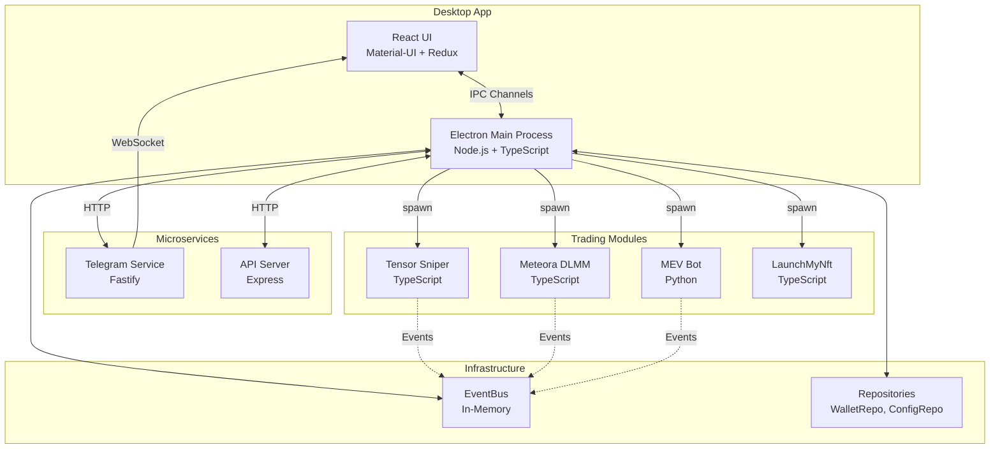
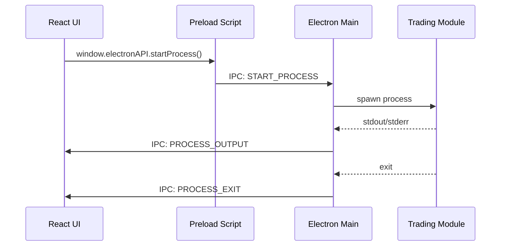
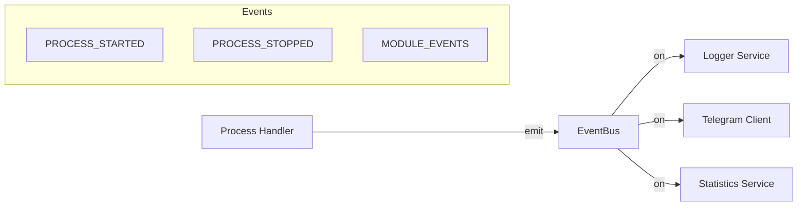

# Punar - Solana Trading Hub

> Кроссплатформенное десктопное приложение для автоматизации торговых операций в экосистеме Solana

[](https://www.typescriptlang.org/)
[](https://www.electronjs.org/)
[](https://reactjs.org/)

## 📋 Содержание

- [О проекте](#о-проекте)
- [Архитектура](#архитектура)
- [Установка](#установка)
- [Конфигурация](#конфигурация)
- [Торговые модули](#торговые-модули)
- [IPC коммуникация](#ipc-коммуникация)
- [Разработка](#разработка)
- [Troubleshooting](#troubleshooting)

## 🎯 О проекте

Punar — это платформа для автоматизации торговых стратегий на Solana, построенная на стеке **Electron + React + TypeScript**. Приложение предоставляет единый интерфейс для управления множеством торговых стратегий, кошельками и мониторинга рыночной активности в реальном времени.

### Основные возможности

- **Модульная архитектура** - подключение внешних торговых модулей (NFT Sniping, MEV-арбитраж, Meteora DLMM)
- **MEV Load Balancer** - автоматическое распределение нагрузки между MEV-процессами
- **Управление кошельками** - создание, импорт и организация Solana кошельков в наборы
- **Telegram Bot** - удаленное управление задачами и real-time уведомления
- **Task Management** - мониторинг логов, автоматический перезапуск процессов

## 🏗️ Архитектура

### Высокоуровневая структура



### Структура проекта

```
punar/
├── electron-app/               # Electron Main Process
│   ├── src/
│   │   ├── api/               # API Server (Express)
│   │   │   ├── api-server.ts
│   │   │   └── telegram-client.ts
│   │   ├── ipcHandlers/       # IPC обработчики
│   │   │   ├── processHandler.ts
│   │   │   ├── walletHandler.ts
│   │   │   ├── settingsHandler.ts
│   │   │   ├── telegramHandler.ts
│   │   │   └── ...
│   │   ├── repositories/      # Слой данных
│   │   │   ├── WalletRepository.ts
│   │   │   ├── ConfigRepository.ts
│   │   │   └── errors.ts
│   │   ├── services/          # Бизнес-логика
│   │   │   └── loggerService.ts
│   │   ├── utils/             # Утилиты
│   │   │   └── spawnProcess.ts
│   │   ├── index.ts           # Точка входа
│   │   └── preload.ts         # Preload script
│   └── tsconfig.json
│
├── react-app/                  # React Frontend
│   ├── src/
│   │   ├── components/        # React компоненты
│   │   │   ├── TasksPage/
│   │   │   ├── Wallets/
│   │   │   ├── Settings/
│   │   │   ├── CreateTaskWizard/
│   │   │   └── ...
│   │   ├── store/             # Redux Store
│   │   │   ├── store.ts
│   │   │   ├── taskSlice.ts
│   │   │   └── walletSlice.ts
│   │   ├── types/             # React типы
│   │   └── App.tsx
│   └── tsconfig.json
│
├── telegram-service/           # Telegram Bot Microservice
│   ├── src/
│   │   ├── routes/            # API маршруты
│   │   │   ├── bot.routes.ts
│   │   │   └── notification.routes.ts
│   │   ├── services/          # Бизнес-логика
│   │   │   ├── bot.service.ts
│   │   │   └── electron-client.service.ts
│   │   ├── types/             # TypeScript типы
│   │   └── index.ts
│   └── tsconfig.json
│
└── shared/                     # Общие типы и утилиты
    ├── types/                 # TypeScript типы
    │   ├── index.ts
    │   ├── wallet.types.ts
    │   ├── config.types.ts
    │   ├── ipc.types.ts
    │   └── modules.types.ts
    └── eventBus/              # Event-driven коммуникация
        ├── index.ts
        └── events.ts
```

### IPC коммуникация



Полная документация IPC каналов: [IPC_CHANNELS.md](./docs/IPC_CHANNELS.md)

### EventBus система



## 📦 Установка

### Требования

- Node.js >= 18.x
- npm или pnpm
- Python 3.10+ (для MEV модуля)

### Быстрый старт

```bash
# Клонирование репозитория
git clone https://github.com/RaiseBan/Punar.git
cd Punar

# Установка зависимостей
npm install

# Установка зависимостей Telegram сервиса
cd telegram-service && npm install && cd ..

# Настройка конфигурации
cp electron-app/.env.example electron-app/.env
cp telegram-service/.env.example telegram-service/.env

# Запуск в dev режиме
npm run dev
```

### Сборка production

```bash
# Сборка Electron приложения
npm run build

# Создание дистрибутива
npm run dist
```

## ⚙️ Конфигурация

### Основные настройки (Settings)

Все настройки хранятся в `globalConfigs/settings.json`:

```typescript
{
  // RPC endpoints (обязательно)
  mainRpc: "https://your-rpc.com",
  heliusRpcs: ["https://helius-1.com", "https://helius-2.com"],

  // API токены (обязательно)
  tensor_api_token: "your_tensor_token",
  bloxroute_api_token: "your_bloxroute_token",

  // Директории
  scriptDirectory: "/path/to/trading/modules",

  // Telegram
  telegramToken: "bot_token",
  telegramEnabled: true,
  telegramChatIds: [123456789],

  // Jito настройки
  jito_strategy: "PROPORTION",
  jito_lower_bound: "0.0001",
  jito_upper_bound: "0.001"
}
```

### Переменные окружения

**electron-app/.env:**

```env
NODE_ENV=development
TELEGRAM_SERVICE_URL=http://localhost:3003
TELEGRAM_API_KEY=your-secret-api-key-here
```

**telegram-service/.env:**

```env
NODE_ENV=development
PORT=3003
API_KEY=your-secret-api-key-here
ELECTRON_API_URL=http://localhost:3001
```

## 🤖 Торговые модули

### Tensor Sniper (SDK)

NFT снайпинг через Tensor SDK с поддержкой Jito bundles.

**Конфигурация:**

```typescript
{
  module_name: "Tensor sniper (SDK)",
  collectionId: "collection-uuid",
  priceByName: true,
  priceConfig: "price_config.json",
  thresholdPrice: 1.5,
  useJito: true,
  jitoRegion: "amsterdam",
  jitoTipLamports: 10000
}
```

### Tensor Reprice

Автоматическое переценивание NFT листингов.

**Конфигурация:**

```typescript
{
  module_name: "Tensor reprice",
  reprice_config: "reprice_config.json",
  checkInterval: 30000,
  useJito: true
}
```

### Meteora DLMM

Автоматическое управление ликвидностью на Meteora.

**Конфигурация:**

```typescript
{
  module_name: "Meteora",
  accounts: ["pool1", "pool2"],
  strategy: "PROPORTION",
  useJito: true,
  jitoTipAmount: 0.0001,
  additionalParams: {
    SLIPPAGE: 0.01,
    MAX_TX_ATTEMPTS: 3
  }
}
```

### LaunchMyNft

Снайпинг NFT при запуске коллекции.

**Конфигурация:**

```typescript
{
  module_name: "LaunchMyNft",
  target_url: "https://launchmynft.io/collection/...",
  total_priority_fee: 100000,
  compute_unit_limit: 200000,
  useJito: true,
  jito_tip_amount: 0.001,
  nfts_to_buy_per_account: 1
}
```

### MEV Bot

MEV арбитраж на основе мониторинга пулов.

**Конфигурация:**

```typescript
{
  module_name: "MEV token release",
  volumeThreshold: 10000,
  checkInterval: 1000,
  threadWorkers: 4,
  mode: "automatic"
}
```

## 🔌 IPC коммуникация

### Основные каналы

**Process Management:**

```typescript
// Запуск процесса
window.electronAPI.startProcess(taskId, config);

// Остановка процесса
window.electronAPI.stopProcess(taskId);

// Возобновление процесса
window.electronAPI.resumeProcess(taskId, config);
```

**Wallet Management:**

```typescript
// Получить все кошельки
const wallets = await window.electronAPI.getWallets();

// Добавить кошелек
await window.electronAPI.addWallet(wallet);

// Удалить кошелек
await window.electronAPI.deleteWallet(publicKey);
```

**Settings Management:**

```typescript
// Получить настройки
const settings = await window.electronAPI.getSettings();

// Сохранить настройки
await window.electronAPI.saveSettings(newSettings);
```

**Event Listeners:**

```typescript
// Слушатель запуска процесса
window.electronAPI.onProcessStarted((event, data) => {
  console.log("Process started:", data.taskId);
});

// Слушатель вывода процесса
window.electronAPI.onProcessOutput((event, data) => {
  console.log("Output:", data.output);
});

// Слушатель завершения процесса
window.electronAPI.onProcessExit((event, data) => {
  console.log("Process exited:", data.taskId, data.code);
});
```

Полная документация: [IPC_CHANNELS.md](./docs/IPC_CHANNELS.md)

## 🛠️ Разработка

### Скрипты

```bash
# Разработка
npm run dev              # Запуск в dev режиме
npm run dev:react        # Только React dev server
npm run dev:electron     # Только Electron

# Линтинг
npm run lint             # Проверка кода
npm run lint:fix         # Автофикс

# Форматирование
npm run format           # Prettier форматирование
npm run format:check     # Проверка форматирования

# Типы
npm run typecheck        # Проверка TypeScript типов

# Тесты
npm test                 # Запуск тестов
npm run test:watch       # Watch режим
npm run test:coverage    # С покрытием

# Сборка
npm run build            # Production сборка
npm run dist             # Создание дистрибутива
```

### Git hooks

Проект использует Husky для автоматизации:

```bash
# Pre-commit
- ESLint проверка
- Prettier форматирование
- TypeScript проверка типов

# Pre-push
- Запуск тестов
```

### Структура commit messages

```
feat: добавил новую фичу
fix: исправил баг
refactor: рефакторинг кода
docs: обновил документацию
test: добавил тесты
chore: обновление зависимостей
```

## 🐛 Troubleshooting

### Проблема: "Failed to load settings"

**Решение:**

1. Проверьте наличие файла `globalConfigs/settings.json`
2. Убедитесь, что JSON валиден
3. Проверьте права доступа к файлу

### Проблема: "Process failed to start"

**Решение:**

1. Убедитесь, что `scriptDirectory` настроен правильно в Settings
2. Проверьте наличие необходимых модулей в директории
3. Проверьте логи: `logs/task_*.log`

### Проблема: "Telegram bot not responding"

**Решение:**

1. Проверьте, что telegram-service запущен: `http://localhost:3003/health`
2. Проверьте `TELEGRAM_SERVICE_URL` в electron-app/.env
3. Проверьте токен бота в Settings

### Проблема: "IPC timeout errors"

**Решение:**

1. Перезапустите приложение
2. Проверьте EventBus listeners в логах
3. Убедитесь, что нет дублирующихся listeners

### Логи и дебаг

**Расположение логов:**

- Production: `%APPDATA%/electron-app/logs/`
- Development: `electron-app/logs/`

**Включение debug режима:**

```typescript
// electron-app/src/services/loggerService.ts
minimumLogLevel = LOG_LEVELS.DEBUG;
```

### Очистка данных

```bash
# Windows
del /s /q %APPDATA%\electron-app\*

# Linux/macOS
rm -rf ~/.config/electron-app/*
```

## 📝 Лицензия

MIT License

## 🤝 Контакты

- GitHub: [RaiseBan/Punar](https://github.com/RaiseBan/Punar)
- Issues: [GitHub Issues](https://github.com/RaiseBan/Punar/issues)

---

**Сделано с ❤️ для Solana DeFi трейдеров**
