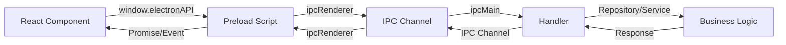

# IPC Channels Documentation

> Полная документация IPC коммуникации между React и Electron процессами

## 📋 Содержание

- [Обзор](#обзор)
- [Process Management](#process-management)
- [Wallet Management](#wallet-management)
- [Settings Management](#settings-management)
- [Config Management](#config-management)
- [Telegram Bot](#telegram-bot)
- [Tensor API](#tensor-api)
- [Window Controls](#window-controls)
- [Event System](#event-system)
- [Типы данных](#типы-данных)

## Обзор

IPC (Inter-Process Communication) каналы обеспечивают типобезопасное взаимодействие между React (renderer) и Electron (main) процессами.

### Архитектура



### Типы IPC взаимодействия

**1. Request-Response (invoke/handle):**

```typescript
// React → Electron → React
const result = await window.electronAPI.getWallets();
```

**2. Fire-and-forget (send/on):**

```typescript
// React → Electron
window.electronAPI.startProcess(taskId, config);
```

**3. Event Listeners (on/emit):**

```typescript
// Electron → React
window.electronAPI.onProcessOutput((event, data) => {
  console.log(data.output);
});
```

## Process Management

### startProcess

Запуск торгового модуля.

**Сигнатура:**

```typescript
startProcess(taskId: number, config: TaskConfig): void
```

**Параметры:**

- `taskId` - уникальный ID задачи
- `config` - конфигурация модуля (см. [TaskConfig](#taskconfig))

**Пример:**

```typescript
window.electronAPI.startProcess(1, {
  module_name: "Tensor sniper (SDK)",
  task_name: "My NFT Sniper",
  collectionId: "abc-123",
  useJito: true,
  jitoRegion: "amsterdam",
});
```

**IPC канал:** `START_PROCESS`

---

### stopProcess

Остановка запущенного процесса.

**Сигнатура:**

```typescript
stopProcess(taskId: number): void
```

**Параметры:**

- `taskId` - ID задачи для остановки

**Пример:**

```typescript
window.electronAPI.stopProcess(1);
```

**Детали:**

- Отправляет SIGTERM процессу
- Через 5 секунд отправляет SIGKILL если процесс не завершился
- Генерирует событие `PROCESS_EXIT`

**IPC канал:** `STOP_PROCESS`

---

### resumeProcess

Возобновление остановленного процесса.

**Сигнатура:**

```typescript
resumeProcess(taskId: number, config: TaskConfig): void
```

**Параметры:**

- `taskId` - ID задачи для возобновления
- `config` - конфигурация модуля

**Пример:**

```typescript
window.electronAPI.resumeProcess(1, previousConfig);
```

**IPC канал:** `RESUME_PROCESS`

---

### onProcessStarted

Слушатель события запуска процесса.

**Сигнатура:**

```typescript
onProcessStarted(callback: (event: IpcRendererEvent, data: ProcessStartedEvent) => void): void
```

**Параметры callback:**

```typescript
interface ProcessStartedEvent {
  taskId: number;
  config: TaskConfig;
}
```

**Пример:**

```typescript
window.electronAPI.onProcessStarted((event, data) => {
  console.log(`Process ${data.taskId} started with config:`, data.config);
  updateTaskStatus(data.taskId, "running");
});
```

**IPC канал:** `PROCESS_STARTED`

---

### onProcessOutput

Слушатель вывода процесса (stdout/stderr).

**Сигнатура:**

```typescript
onProcessOutput(callback: (event: IpcRendererEvent, data: ProcessOutputEvent) => void): void
```

**Параметры callback:**

```typescript
interface ProcessOutputEvent {
  taskId: number;
  output: string;
  type: "stdout" | "stderr";
  timestamp: number;
}
```

**Пример:**

```typescript
window.electronAPI.onProcessOutput((event, data) => {
  const logEntry = `[${new Date(data.timestamp).toISOString()}] ${data.output}`;
  appendLog(data.taskId, logEntry);
});
```

**IPC канал:** `PROCESS_OUTPUT`

**Детали:**

- Логи батчируются (отправляются каждые 500ms)
- Автоматически записываются в файл: `logs/task_{taskId}.log`

---

### onProcessExit

Слушатель завершения процесса.

**Сигнатура:**

```typescript
onProcessExit(callback: (event: IpcRendererEvent, data: ProcessExitEvent) => void): void
```

**Параметры callback:**

```typescript
interface ProcessExitEvent {
  taskId: number;
  code: number | null;
}
```

**Пример:**

```typescript
window.electronAPI.onProcessExit((event, data) => {
  const status = data.code === 0 ? "success" : "error";
  updateTaskStatus(data.taskId, status);

  if (data.code !== 0) {
    showNotification(`Process ${data.taskId} exited with code ${data.code}`);
  }
});
```

**IPC канал:** `PROCESS_EXIT`

**Exit codes:**

- `0` - нормальное завершение
- `1` - общая ошибка
- `2` - неправильная конфигурация
- `null` - процесс был убит

---

### onProcessError

Слушатель ошибок процесса.

**Сигнатура:**

```typescript
onProcessError(callback: (event: IpcRendererEvent, data: ProcessErrorEvent) => void): void
```

**Параметры callback:**

```typescript
interface ProcessErrorEvent {
  taskId: number;
  error: string;
}
```

**Пример:**

```typescript
window.electronAPI.onProcessError((event, data) => {
  console.error(`Process ${data.taskId} error:`, data.error);
  showErrorNotification(data.error);
});
```

**IPC канал:** `PROCESS_ERROR`

## Wallet Management

### getWallets

Получить список всех кошельков.

**Сигнатура:**

```typescript
getWallets(): Promise<Wallet[]>
```

**Возвращает:**

```typescript
interface Wallet {
  name: string;
  publicKey: string;
  privateKey: string;
  balance?: number;
}
```

**Пример:**

```typescript
const wallets = await window.electronAPI.getWallets();
console.log(`Total wallets: ${wallets.length}`);
```

**IPC канал:** `GET_WALLETS`

**Детали:**

- Кошельки хранятся в `globalConfigs/wallets.json`
- Приватные ключи должны храниться зашифрованными

---

### addWallet

Добавить новый кошелек.

**Сигнатура:**

```typescript
addWallet(wallet: Wallet): Promise<void>
```

**Параметры:**

```typescript
interface Wallet {
  name: string;
  publicKey: string;
  privateKey: string;
}
```

**Пример:**

```typescript
await window.electronAPI.addWallet({
  name: "Trading Wallet #1",
  publicKey: "DYw8jCTfwH...",
  privateKey: "base58_encoded_key",
});
```

**IPC канал:** `ADD_WALLET`

**Валидация:**

- `name` - не может быть пустым
- `publicKey` - должен быть валидным Solana адресом (base58)
- `privateKey` - должен быть валидным приватным ключом

**Ошибки:**

```typescript
// Дубликат publicKey
throw new WalletError("Кошелек с таким publicKey уже существует");

// Невалидный формат
throw new ValidationError("Невалидный формат publicKey", "publicKey");
```

---

### deleteWallet

Удалить кошелек.

**Сигнатура:**

```typescript
deleteWallet(publicKey: string): Promise<void>
```

**Параметры:**

- `publicKey` - публичный ключ кошелька для удаления

**Пример:**

```typescript
await window.electronAPI.deleteWallet("DYw8jCTfwH...");
```

**IPC канал:** `DELETE_WALLET`

**Детали:**

- Возвращает `true` если кошелек был удален
- Возвращает `false` если кошелек не найден

## Settings Management

### getSettings

Получить глобальные настройки приложения.

**Сигнатура:**

```typescript
getSettings(): Promise<AppSettings>
```

**Возвращает:**

```typescript
interface AppSettings {
  // RPC endpoints
  mainRpc: string;
  heliusRpcs: string[];
  additionalRpc?: string;

  // API tokens
  tensor_api_token: string;
  bloxroute_api_token?: string;

  // Directories
  scriptDirectory?: string;
  mevBotDirectory?: string;

  // Telegram
  telegramToken?: string;
  telegramEnabled?: boolean;
  telegramChatIds?: number[];

  // Jito
  jito_strategy?: string;
  jito_lower_bound?: string;
  jito_upper_bound?: string;

  // Wallet Sets
  walletsSet?: { [setName: string]: string[] };
}
```

**Пример:**

```typescript
const settings = await window.electronAPI.getSettings();
console.log("Main RPC:", settings.mainRpc);
console.log("Telegram enabled:", settings.telegramEnabled);
```

**IPC канал:** `GET_SETTINGS`

**Детали:**

- Настройки хранятся в `globalConfigs/settings.json`
- Кэшируются в памяти после первого чтения
- Если файл не существует, возвращает пустой объект `{}`

---

### saveSettings

Сохранить глобальные настройки.

**Сигнатура:**

```typescript
saveSettings(settings: AppSettings): Promise<void>
```

**Параметры:**

- `settings` - объект настроек для сохранения

**Пример:**

```typescript
await window.electronAPI.saveSettings({
  mainRpc: "https://api.mainnet-beta.solana.com",
  heliusRpcs: ["https://rpc.helius.xyz"],
  tensor_api_token: "your_token",
  telegramEnabled: true,
  telegramChatIds: [123456789],
});
```

**IPC канал:** `SAVE_SETTINGS`

**Валидация:**

- Проверяет формат JSON
- Создает директорию если не существует
- Обновляет кэш

## Config Management

### saveConfig

Сохранить конфигурационный файл модуля.

**Сигнатура:**

```typescript
saveConfig(
  configType: ConfigType,
  fileName: string,
  content: unknown
): Promise<boolean>
```

**Параметры:**

- `configType` - тип конфига (`'reprice_config'` | `'snipe_config'`)
- `fileName` - имя файла (без расширения)
- `content` - содержимое конфига

**Пример:**

```typescript
await window.electronAPI.saveConfig("snipe_config", "my_strategy", {
  collectionId: "abc-123",
  priceThreshold: 1.5,
  maxBuyAmount: 10,
});
```

**IPC канал:** `SAVE_CONFIG`

---

### getConfigs

Получить список конфигов определенного типа.

**Сигнатура:**

```typescript
getConfigs(configType: ConfigType): Promise<string[]>
```

**Параметры:**

- `configType` - тип конфига (`'reprice_config'` | `'snipe_config'`)

**Возвращает:** массив имен файлов (без расширения)

**Пример:**

```typescript
const snipeConfigs = await window.electronAPI.getConfigs("snipe_config");
// ["strategy1", "strategy2", "nft_hunt"]
```

**IPC канал:** `GET_CONFIGS`

---

### getConfig

Получить содержимое конфига.

**Сигнатура:**

```typescript
getConfig(configType: ConfigType, fileName: string): Promise<unknown>
```

**Параметры:**

- `configType` - тип конфига
- `fileName` - имя файла

**Пример:**

```typescript
const config = await window.electronAPI.getConfig("snipe_config", "strategy1");
console.log("Collection ID:", config.collectionId);
```

**IPC канал:** `GET_CONFIG`

---

### deleteConfig

Удалить конфигурационный файл.

**Сигнатура:**

```typescript
deleteConfig(configType: ConfigType, fileName: string): Promise<boolean>
```

**Параметры:**

- `configType` - тип конфига
- `fileName` - имя файла для удаления

**Пример:**

```typescript
const deleted = await window.electronAPI.deleteConfig(
  "snipe_config",
  "old_strategy",
);
if (deleted) {
  console.log("Config deleted successfully");
}
```

**IPC канал:** `DELETE_CONFIG`

## Telegram Bot

### telegramBot.getConfig

Получить конфигурацию Telegram бота.

**Сигнатура:**

```typescript
telegramBot.getConfig(): Promise<TelegramBotConfig>
```

**Возвращает:**

```typescript
interface TelegramBotConfig {
  token: string;
  enabled: boolean;
  chatIds: number[];
}
```

**Пример:**

```typescript
const config = await window.electronAPI.telegramBot.getConfig();
console.log("Bot enabled:", config.enabled);
console.log("Chat IDs:", config.chatIds);
```

**IPC канал:** `TELEGRAM_GET_CONFIG`

---

### telegramBot.setToken

Установить токен бота.

**Сигнатура:**

```typescript
telegramBot.setToken(token: string): Promise<{ success: boolean; error?: string }>
```

**Параметры:**

- `token` - Telegram bot token

**Пример:**

```typescript
const result =
  await window.electronAPI.telegramBot.setToken("123456:ABC-DEF...");
if (result.success) {
  console.log("Token set successfully");
} else {
  console.error("Error:", result.error);
}
```

**IPC канал:** `TELEGRAM_SET_TOKEN`

---

### telegramBot.getStatus

Получить статус бота.

**Сигнатура:**

```typescript
telegramBot.getStatus(): Promise<TelegramBotStatus>
```

**Возвращает:**

```typescript
interface TelegramBotStatus {
  isRunning: boolean;
  isConfigured: boolean;
  chatCount: number;
  lastActivity?: string;
}
```

**Пример:**

```typescript
const status = await window.electronAPI.telegramBot.getStatus();
if (status.isRunning) {
  console.log("Bot is active, chats:", status.chatCount);
}
```

**IPC канал:** `TELEGRAM_GET_STATUS`

---

### telegramBot.start

Запустить бота.

**Сигнатура:**

```typescript
telegramBot.start(): Promise<{ success: boolean; error?: string }>
```

**Пример:**

```typescript
const result = await window.electronAPI.telegramBot.start();
if (!result.success) {
  alert("Failed to start bot: " + result.error);
}
```

**IPC канал:** `TELEGRAM_START_BOT`

---

### telegramBot.stop

Остановить бота.

**Сигнатура:**

```typescript
telegramBot.stop(): Promise<{ success: boolean; error?: string }>
```

**Пример:**

```typescript
await window.electronAPI.telegramBot.stop();
```

**IPC канал:** `TELEGRAM_STOP_BOT`

---

### telegramBot.testConnection

Проверить подключение к боту.

**Сигнатура:**

```typescript
telegramBot.testConnection(): Promise<{ success: boolean; error?: string }>
```

**Пример:**

```typescript
const result = await window.electronAPI.telegramBot.testConnection();
if (result.success) {
  console.log("Bot connection OK");
}
```

**IPC канал:** `TELEGRAM_TEST_CONNECTION`

## Tensor API

### tensorAPI.getCollectionInfo

Получить информацию о коллекции по slug.

**Сигнатура:**

```typescript
tensorAPI.getCollectionInfo(slug: string): Promise<string | null>
```

**Параметры:**

- `slug` - slug коллекции на Tensor

**Пример:**

```typescript
const info = await window.electronAPI.tensorAPI.getCollectionInfo("degods");
console.log("Collection info:", JSON.parse(info));
```

**IPC канал:** `TENSOR_GET_COLLECTION_INFO`

---

### tensorAPI.getCollIdByUrl

Получить ID коллекции по URL.

**Сигнатура:**

```typescript
tensorAPI.getCollIdByUrl(url: string): Promise<string | null>
```

**Параметры:**

- `url` - URL страницы коллекции на Tensor

**Пример:**

```typescript
const collId = await window.electronAPI.tensorAPI.getCollIdByUrl(
  "https://www.tensor.trade/trade/degods",
);
console.log("Collection ID:", collId);
```

**IPC канал:** `TENSOR_GET_COLL_ID_BY_URL`

---

### tensorAPI.getNftsForCollection

Получить NFT из коллекции.

**Сигнатура:**

```typescript
tensorAPI.getNftsForCollection(
  collId: string,
  limit?: number,
  onlyListings?: boolean
): Promise<unknown>
```

**Параметры:**

- `collId` - ID коллекции
- `limit` - количество NFT (по умолчанию 1)
- `onlyListings` - только листинги (по умолчанию false)

**Пример:**

```typescript
const nfts = await window.electronAPI.tensorAPI.getNftsForCollection(
  "abc-123",
  10,
  true,
);
console.log("NFTs:", nfts);
```

**IPC канал:** `TENSOR_GET_NFTS_FOR_COLLECTION`

## Window Controls

### minimizeWindow

Свернуть окно приложения.

**Сигнатура:**

```typescript
minimizeWindow(): Promise<void>
```

**Пример:**

```typescript
await window.electronAPI.minimizeWindow();
```

**IPC канал:** `MINIMIZE_WINDOW`

---

### closeWindow

Закрыть окно приложения.

**Сигнатура:**

```typescript
closeWindow(): Promise<void>
```

**Пример:**

```typescript
await window.electronAPI.closeWindow();
```

**IPC канал:** `CLOSE_WINDOW`

---

### enableDrag

Включить перетаскивание окна.

**Сигнатура:**

```typescript
enableDrag(): void
```

**Пример:**

```typescript
window.electronAPI.enableDrag();
```

**IPC канал:** `ENABLE_DRAG`

## Event System

### removeListener

Удалить конкретный слушатель.

**Сигнатура:**

```typescript
removeListener(channel: string, callback: (...args: unknown[]) => void): void
```

**Параметры:**

- `channel` - имя IPC канала
- `callback` - функция-обработчик

**Пример:**

```typescript
const handler = (event, data) => console.log(data);
window.electronAPI.onProcessOutput(handler);

// Позже удаляем
window.electronAPI.removeListener("process-output", handler);
```

---

### removeAllListeners

Удалить все слушатели процессов.

**Сигнатура:**

```typescript
removeAllListeners(): void
```

**Пример:**

```typescript
// При размонтировании компонента
useEffect(() => {
  return () => {
    window.electronAPI.removeAllListeners();
  };
}, []);
```

**Удаляет слушатели для:**

- `PROCESS_STARTED`
- `PROCESS_OUTPUT`
- `PROCESS_EXIT`

## Типы данных

### TaskConfig

Базовая конфигурация задачи:

```typescript
interface TaskConfig {
  module_name: string;
  task_name: string;
  main_rpc: string;

  // Module-specific params
  [key: string]: unknown;
}
```

### Tensor SDK Config

```typescript
interface TensorSdkConfig extends TaskConfig {
  module_name: "Tensor sniper (SDK)";
  collectionId: string;
  priceByName: boolean;
  priceConfig: string;
  thresholdPrice: number;
  useJito: boolean;
  jitoRegion: string;
  jitoTipLamports: number;
  delta: number;
  txToSend: number;
  walletSource: WalletSource;
  privateKey: string;
}
```

### Meteora Config

```typescript
interface MeteoraConfig extends TaskConfig {
  module_name: "Meteora";
  accounts: string[];
  useJito: boolean;
  jitoTipAmount: number;
  strategy: string;
  privateKey: string;
  additionalParams: {
    CONFIRMATION_TIMEOUT: number;
    MAX_TX_ATTEMPTS: number;
    SLIPPAGE: number;
  };
}
```

### LaunchMyNft Config

```typescript
interface LaunchMyNftConfig extends TaskConfig {
  module_name: "LaunchMyNft";
  target_url: string;
  total_priority_fee: number;
  compute_unit_limit: number;
  useJito: boolean;
  jito_tip_amount: number;
  nfts_to_buy_per_account: number;
  walletSource: WalletSource;
}
```

## Best Practices

### 1. Очистка слушателей

```typescript
useEffect(() => {
  const handleOutput = (event, data) => {
    console.log(data.output);
  };

  window.electronAPI.onProcessOutput(handleOutput);

  return () => {
    window.electronAPI.removeListener("process-output", handleOutput);
  };
}, []);
```

### 2. Обработка ошибок

```typescript
try {
  await window.electronAPI.addWallet(wallet);
} catch (error) {
  if (error.message.includes("уже существует")) {
    showError("Wallet already exists");
  } else {
    showError("Failed to add wallet");
  }
}
```

### 3. Типобезопасность

```typescript
// Используйте TypeScript типы
import { TaskConfig, Wallet } from "../../shared/types";

const config: TaskConfig = {
  module_name: "Tensor sniper (SDK)",
  // ...
};
```

### 4. Batch операции

```typescript
// Плохо - много IPC вызовов
for (const wallet of wallets) {
  await window.electronAPI.addWallet(wallet);
}

// Хорошо - один вызов
// (если есть соответствующий метод)
await window.electronAPI.addWallets(wallets);
```

## Отладка IPC

### Включение логирования

```typescript
// electron-app/src/preload.ts
ipcRenderer.on("*", (channel, ...args) => {
  console.log("[IPC]", channel, args);
});
```

### Проверка доступности API

```typescript
console.log("electronAPI available:", !!window.electronAPI);
console.log("Methods:", Object.keys(window.electronAPI));
```

### Тестирование каналов

```typescript
// Проверка базовой коммуникации
const settings = await window.electronAPI.getSettings();
console.log("IPC working, settings:", settings);
```

---

**Полный список IPC каналов:** [shared/types/ipc.types.ts](../shared/types/ipc.types.ts)
